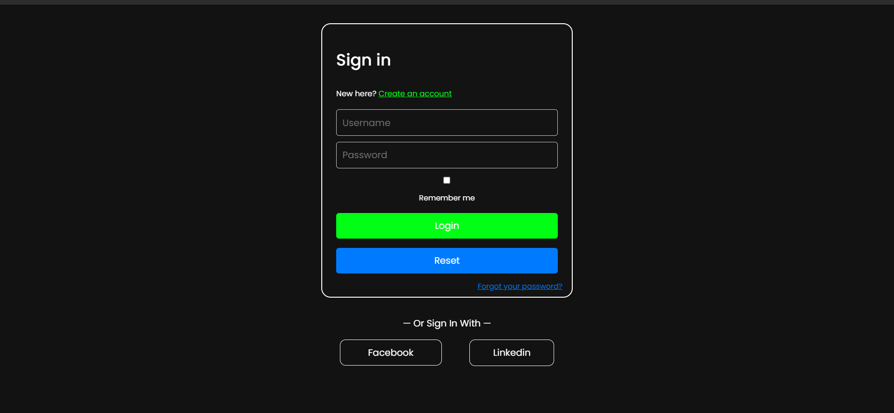

# Sign In Form

This repository contains an animation template built using Tailwind CSS with AOS animations.

## Demo

You can view a live demo of this animation template [here](https://d-vokic.github.io/Sign-in-form/).

## Overview

This project is a simple sign-in form designed with HTML, SASS, and JavaScript, utilizing modern ES6 techniques and embracing functional programming principles. It offers a secure and user-friendly interface for users to authenticate their accounts. 

The sign-in form provides various functionalities such as logging in with existing credentials, creating new accounts, and resetting passwords. The project adheres to modern web development practices, employing modular architecture and advanced ES6 features for enhanced functionality and maintainability, all while emphasizing a functional programming style.

## File Structure

- **assets/**
- **gitignore**
- **index.html**
- **assets/**
  - **cs/**
    - **style.css**
  - **img/**
    - *[image files]*
  - **js/**
    - *[JavaScript files]*
  - **scss/**
    - *[SASS files]*

## Features

- **User Authentication**: Allows users to sign in with their username and password.
- **Account Creation**: Provides a seamless process for users to create new accounts.
- **Password Reset**: Offers users the option to reset their passwords securely.
- **Responsive Design**: Ensures compatibility across various devices for optimal user experience.
- **Modular Architecture**: Organizes codebase into modular components for easy maintenance and scalability.
- **Functional Programming**: Embraces functional programming principles for cleaner and more efficient code, leveraging features like Arrow Functions, Template Literals, Destructuring Assignment, and Spread Operator.
- **Advanced ES6 Techniques**: Utilizes advanced ECMAScript 6 features such as Arrow Functions, Template Literals, Destructuring Assignment, Spread Operator, Default Parameters, and Classes for improved development workflow.

## Getting Started

To run the project locally, follow these steps:

1. Clone this repository to your local machine.
2. Open the `index.html` file in your preferred web browser.
3. Explore the sign-in form and its functionalities.

## Technologies Used

- **HTML**: Provides the structure and semantics of the sign-in form.
- **SASS**: Enhances CSS with features like variables, nesting, and mixins for better styling.
- **JavaScript (ES6)**: Implements interactive elements and client-side validation using modern ES6 techniques.

## Contributing

Contributions to this project are welcome! If you'd like to contribute, please follow these guidelines:

1. Fork the repository.
2. Create a new branch for your feature (`git checkout -b feature/YourFeature`).
3. Implement your changes and ensure they adhere to the project's coding standards.
4. Test your changes thoroughly.
5. Commit your changes with descriptive commit messages (`git commit -m 'Add feature: Description'`).
6. Push your changes to your forked repository (`git push origin feature/YourFeature`).
7. Open a pull request, providing a detailed description of your changes.

## Support

If you're having any problem, please raise an issue on GitHub and the maintainers will help you out.

## License

This project is licensed under the MIT License - see the [LICENSE](./LICENSE.md) file for details.

## Acknowledgements

Special thanks to [OpenAI](https://openai.com) for providing the underlying technology to develop this assistant.

## Author

This animation template is maintained by Duško Vokić. You can reach out to me on [GitHub](https://github.com/D-vokic?tab=repositories) or [LinkedIn](https://www.linkedin.com/in/du%C5%A1ko-voki%C4%87-0337a2106) for any queries or suggestions.
